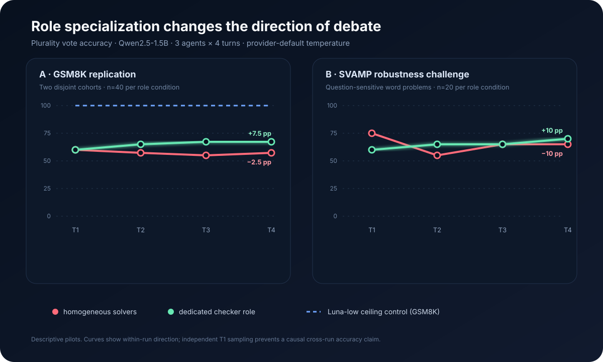
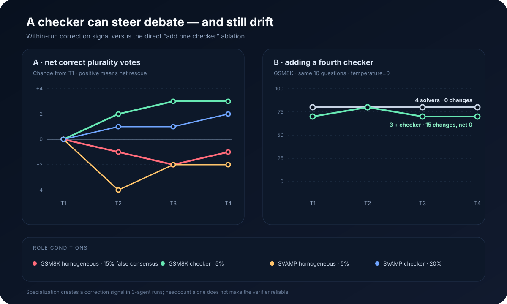
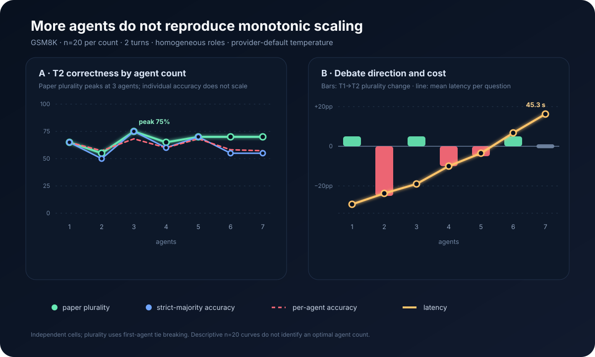

# Can specialized verification rescue small-model debate?

## Exploratory evidence from Qwen2.5-1.5B on GSM8K and SVAMP

**Date:** 2026-08-27

**Status:** 40 questions per primary GSM8K condition and 20 per SVAMP
condition. The results are descriptive evidence about mechanisms, not claims of
statistical significance.

## Summary

We asked a narrower question than whether weak models become more or less
accurate through debate: can a dedicated verification responsibility give
error correction a more consistent direction?

The main protocol used three agents, four turns of full reasoning context, and
the paper's plurality vote. It used no search, response schema, developer
message, dynamic role generation, or directed claim metadata.

Across 40 GSM8K questions, the homogeneous condition moved from **60% to
57.5%**, while replacing the third solver with an arithmetic checker moved from
**60% to 67.5%**. The checker condition improved over turns in both independent
20-question cohorts (+10 and +5 percentage points); the homogeneous condition
moved in opposite directions (-10 and +5 points). At the final turn, however,
the paired difference was only five checker-only wins and one homogeneous-only
win (exact McNemar `p=0.219`). The direction is suggestive, but the evidence is
too small to establish a stable absolute advantage.

On a 20-question SVAMP challenge set, the homogeneous condition moved from
**75% to 65%**, while a semantic checker moved from **60% to 70%**. The checker
rescued 2 of 8 initially wrong group answers and preserved all 12 initially
correct answers. The two independent runs began 15 points apart, however, and
the final paired advantage was only one question. Provider-default sampling
remains a major confounder.

We also tested whether simply adding a checker was sufficient. At temperature
zero, four homogeneous solvers stayed at 80%, while three solvers plus a
semantic checker stayed at 70% after briefly reaching 80% on turn two. A
specialized verifier can change correction dynamics, but adding one more
synchronous checker does not automatically improve correctness. The checker
can itself be contaminated by peer context.

Finally, a Figure 9(a)-style sweep did not reproduce monotonic scaling. With a
fixed two-turn protocol and the same 20 questions sampled independently for
each condition, plurality accuracy for 1–7 agents was
**65/55/75/65/70/70/70%**. Three agents produced the highest point, five to
seven agents formed a 70% plateau, and mean latency rose from 4.0 to 45.3
seconds.

## Experiment design

| Item | Setting |
| --- | --- |
| Model | Ollama `Qwen2.5-1.5B-Instruct`, Q4_K_M |
| GSM8K | Pinned `openai/gsm8k` test revision; two disjoint 20-question cohorts |
| SVAMP | Pinned `MU-NLPC/Calc-svamp` test revision; 20 questions at seed 19 |
| Main trajectories | 3 agents × 4 turns; one trajectory scored as nested T1–T4 snapshots |
| Additional ablation | 4 agents × 4 turns; four solvers versus three solvers plus a semantic checker |
| Agent sweep | 1–7 agents × 2 turns; the same 20 questions, independently sampled per cell |
| Vote | Paper plurality; ties use the reference implementation's first-agent rule |
| Input | Phase-specific natural language; own assistant history plus peers' latest full text |
| Output | Plain text; no schemas, tools, developer message, claims, or targets |
| Sampling | Provider default for main runs; temperature zero for the 4-agent ablation |
| Completion | All reported Qwen2.5 conditions completed 100% of requested samples |

The first ten GSM8K questions used an early 2,048-token request budget; later
runs used 32,768 tokens. Actual Qwen2.5 outputs were well below both limits and
none were truncated, so the samples were combined. Raw transcripts, JSONL, and
aggregate files remain in ignored local storage and are not distributed.

## GSM8K: the checker's directional effect repeated

| Condition | n | T1 | T2 | T3 | T4 | Initially wrong rescued | Initially correct lost |
| --- | ---: | ---: | ---: | ---: | ---: | ---: | ---: |
| Homogeneous | 40 | **60%** | 57.5% | 55% | **57.5%** | 2 / 16 | 3 / 24 |
| Arithmetic checker | 40 | **60%** | 65% | 67.5% | **67.5%** | 5 / 16 | 2 / 24 |
| Luna-low homogeneous | 20 | **100%** | 100% | 100% | **100%** | 0 / 0 | 0 / 20 |

The two 20-question cohorts changed as follows:

| Condition | Cohort A | Cohort B |
| --- | ---: | ---: |
| Homogeneous | 65% → 55% | 55% → 60% |
| Arithmetic checker | 60% → 70% | 60% → 65% |

Across the combined runs, homogeneous agents made 171 answer changes, including
44 incorrect-to-correct and 39 correct-to-incorrect transitions: a net gain of
five correct agent answers. Checker runs made 150 changes, including 47
incorrect-to-correct and 33 correct-to-incorrect transitions: a net gain of
14. The main difference was that corrections were more likely to persist, not
that agents changed their answers more often.

At T4, both conditions were correct on 22 questions and wrong on 12. The
checker alone was correct on five; the homogeneous group alone was correct on
one. Six discordant pairs are too few to treat the 10-point gap as an
established causal role effect.

## Agent count: no monotonic scaling

Du et al. Figure 9(a) holds the round count fixed while increasing the number
of agents. We ran one to seven homogeneous agents for two turns on the same 20
GSM8K questions. All 140 question-condition results and 1,120 model calls
completed without provider failure.

| Agents | T1 plurality | T2 plurality | T2 strict majority | T2 agent accuracy | T1→T2 vote | Mean latency |
| ---: | ---: | ---: | ---: | ---: | ---: | ---: |
| 1 | 60% | 65% | 65% | 65.0% | +5 pp | 4.0 s |
| 2 | 80% | 55% | 50% | 57.5% | -25 pp | 9.1 s |
| 3 | 70% | **75%** | **75%** | **68.3%** | +5 pp | 13.4 s |
| 4 | 75% | 65% | 60% | 60.0% | -10 pp | 21.6 s |
| 5 | 75% | 70% | 70% | 68.0% | -5 pp | 27.6 s |
| 6 | 65% | 70% | 55% | 58.3% | +5 pp | 36.8 s |
| 7 | 70% | 70% | 55% | 57.1% | 0 pp | 45.3 s |

The curve is jagged rather than monotonic. Six- and seven-agent plurality was
70%, while strict-majority accuracy was only 55% and mean individual-agent
accuracy was 58.3% and 57.1%. A larger group did not make its members better
reasoners; when wrong answers were dispersed, plurality could still select the
correct answer.

The paper-compatible vote chooses the first agent whenever multiple answers
tie for highest frequency. This amplifies position effects in small samples,
especially with even agent counts. For example, two-agent T1 plurality was 80%
while strict-majority accuracy was 40%; the corresponding values were 75% and
40% for four agents, and 65% and 40% for six. Multiway ties can also occur with
odd group sizes, so the sawtooth shape cannot be attributed entirely to
collective reasoning.

Each cell independently resampled T1. The 3×2 run moved 70% to 75%, while an
independent 3×4 replication moved 55% to 65%. The provider-default 4×2 run moved
75% to 65%, while the temperature-zero 4×4 ablation stayed at 80%. At n=20,
sampling variation is large enough to cover much of the apparent agent-count
effect. The evidence supports only that monotonic improvement was not observed;
it does not estimate an optimal group size.

## SVAMP: the same direction with more false consensus

[SVAMP](https://aclanthology.org/2021.naacl-main.168/) changes questions, adds
irrelevant quantities, and varies structure to test sensitivity to the actual
quantity being requested. An independent T1 screen on these 20 questions
produced 55% plurality accuracy, avoiding both ceiling and floor.

| Condition | T1 | T2 | T3 | T4 | Initially wrong rescued | Initially correct lost | False consensus |
| --- | ---: | ---: | ---: | ---: | ---: | ---: | ---: |
| Homogeneous | **75%** | 55% | 65% | **65%** | 0 / 5 | 2 / 15 | 5% |
| Semantic checker | **60%** | 65% | 65% | **70%** | 2 / 8 | 0 / 12 | 20% |

The semantic checker was instructed to identify the requested quantity and
unit, recompute from the original facts, locate the earliest semantic or
arithmetic divergence, and ignore majority or verbosity unless its own work
supported them. It raised agent-level transition balance from +3 to +7 while
reducing answer changes from 81 to 48.

It also raised final consensus from 60% to 85%, including four wrong unanimous
answers. Stronger role constraints can increase both correct and incorrect
convergence; agreement is still not a proxy for correctness. At T4, the checker
condition alone won two questions and the homogeneous condition alone won one.
The sample and different initial draws cannot support an absolute ranking.

## Why homogeneous debate had no stable direction

### Full reasoning was present

All 480 homogeneous GSM8K messages were retained during analysis. Mean body
length from T1 through T4 was 654, 749, 760, and 756 characters. Only four of
the 360 later-turn answers were shorter than 120 characters. The model could
read, repeat, and extend peer reasoning; the failure occurred in candidate
discrimination rather than missing context.

### Wrong explanations became correlated

In one sample, the source question contained the malformed phrase “She ate 5
five cookies.” Two agents initially interpreted it as five cookies and reached
the correct answer; another treated it as `5 × 5`. On the next turn, the two
correct agents copied the more elaborate but incorrect interpretation, creating
a wrong consensus.

In another sample, the group trajectory was `91 → 515 → 91 → 39`. The final
turn correctly computed that 39 trees had died, then reported 39 as the number
remaining. Correct candidates were present; the model could not reliably
distinguish logical correctness from longer, more confident explanations.

## Why adding one checker still failed

To isolate sampling temperature, we compared two four-agent conditions on the
same ten questions at temperature zero:

| Four-agent condition | T1 | T2 | T3 | T4 | Answer changes | False consensus |
| --- | ---: | ---: | ---: | ---: | ---: | ---: |
| Four homogeneous solvers | 80% | 80% | 80% | 80% | 0 | 20% |
| Three solvers + semantic checker | 70% | 80% | 70% | 70% | 15 | 30% |

At temperature zero, all four homogeneous solvers produced identical
trajectories: eight questions stayed correct and two stayed wrong. Role
diversity restored variation, but seven incorrect-to-correct transitions were
exactly offset by seven correct-to-incorrect transitions. One answer rescued at
T2 was lost again later.

This rejects the strong claim that one extra checker is sufficient. In the
synchronous architecture, the checker repeatedly verifies peers while also
being influenced by them. A promising comparison is to freeze solver outputs
and invoke a final adjudicator once, outside the opinion-propagation loop.

## Interpreting the checker signal

The specialized agent was not a reliable oracle. Its own T4 accuracy was 65%
on GSM8K, similar to the two solvers, and 65% on SVAMP, below the first solver's
75%. The possible benefit of specialization is a shift in what the group
examines and retains, not an automatic source of truth.

The current evidence supports these narrow conclusions:

1. Homogeneous debate with this small model had no stable net correction
   direction; more turns and longer reasoning did not supply verification.
2. Dedicated verification produced a positive T1-to-T4 signal in both GSM8K
   cohorts and in SVAMP.
3. That signal did not establish a significant or attributable absolute
   accuracy advantage across independently sampled runs.
4. The four-agent ablation rejected the claim that simply adding a synchronous
   checker guarantees improvement.
5. The 1–7-agent sweep showed no monotonic accuracy gain while latency grew by
   roughly eleven times.
6. A one-shot final adjudicator is a more informative next test than adding
   further synchronous rounds or agents.

## Qwen3-0.6B: a protocol-control failure

Qwen3-0.6B's default hidden reasoning conflicted with the local Ollama runtime's
4,096-token context. Only 4 of 20 samples completed in the original run.
Increasing the output budget, creating 8K and 40K context aliases, and adding
`/no_think` still allowed a single update to run for several minutes. This
condition measures completion and protocol controllability, not mathematical
accuracy, and is not comparable with the complete Qwen2.5 curves.

## Boundary with the reference paper

[Du et al. (ICML 2024)](https://openreview.net/forum?id=zj7YuTE4t8) primarily
used `gpt-3.5-turbo-0301`; the appendix also reports a GSM8K gain from 20.7% to
29.3% for chat-Llama 7B. Our results do not imply that open models, or all
models of a few billion parameters, cannot benefit from debate. They apply only
to the quantized 1.5B model, prompts, providers, and small samples described
here.

The reference paper finds that full reasoning can outperform final answers
alone and warns that agreeableness can raise consensus while reducing
performance. Our observations are compatible with both: full reasoning made
useful candidates available, but the receiving model still needed enough
verification ability to resist circular contamination.

## Next experiments

1. Freeze identical T1 solver outputs before branching into homogeneous and
   checker conditions, removing the independently sampled starting-point gap.
2. Compare a one-shot final adjudicator, a four-turn synchronous checker, and a
   rotating verifier.
3. Repeat each role condition across provider seeds and temperatures.
4. Randomize the checker's agent index to measure tie-breaking and position
   effects.
5. Run a small bridge study with 4B and 7B models to locate the point at which a
   verifier becomes a reliable judge rather than another noise source.

Primary metrics should continue to include initially wrong answers rescued,
initially correct answers lost, agent transition balance, and false consensus,
not only final accuracy or agreement.

## Reproduction materials

- [Analysis script](../../scripts/analyze_debate_runs.py)
- [SVAMP adapter](../../apps/api/src/debate_api/benchmark/svamp.py)
- [Ollama context configurations](../../scripts/ollama/)
- [Reference-paper notes](../references/du-et-al-2024-multiagent-debate-notes.md)

Raw sample files, aggregates, and transcript databases are intentionally kept
outside version control and are not part of the public release.
